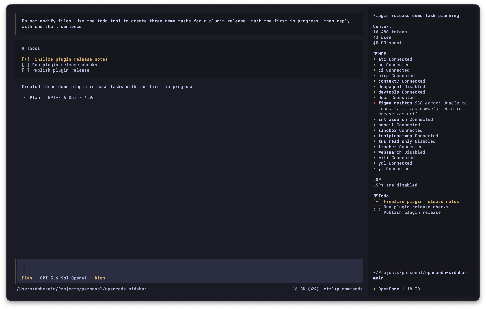
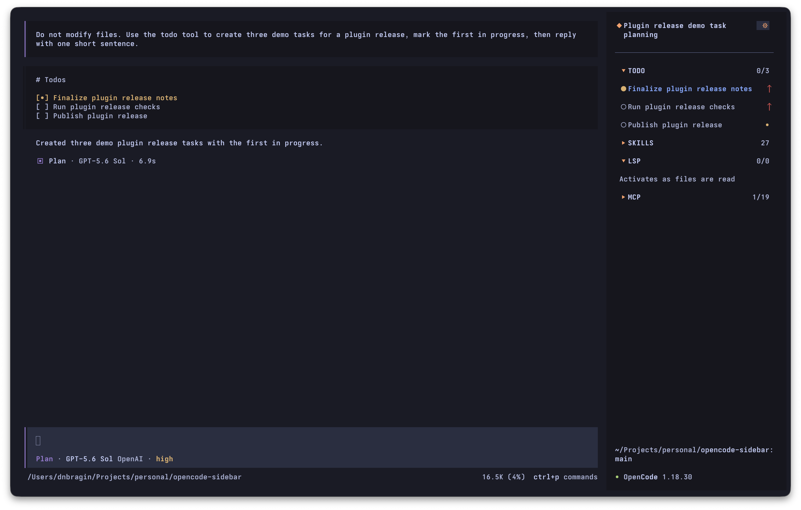
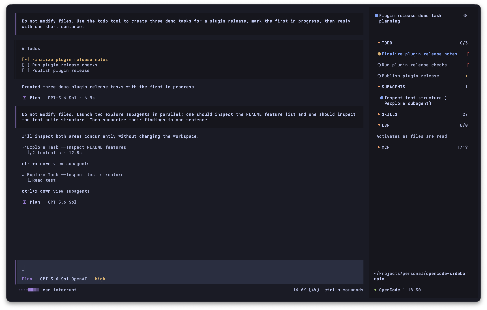
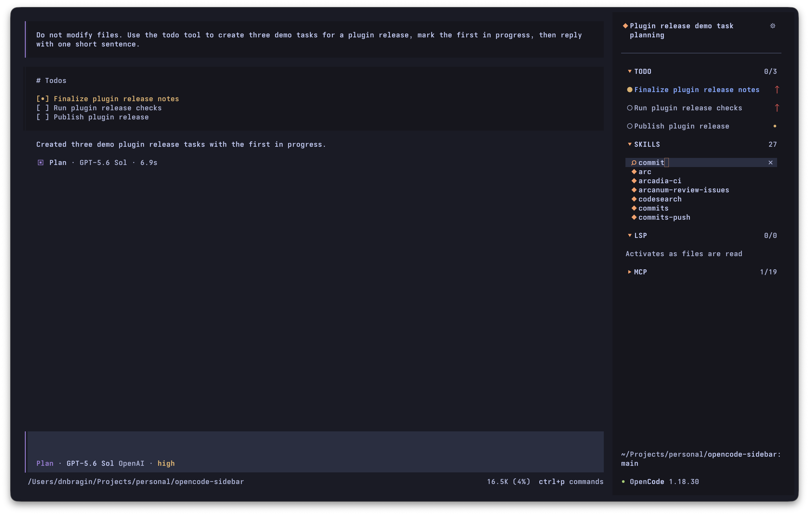
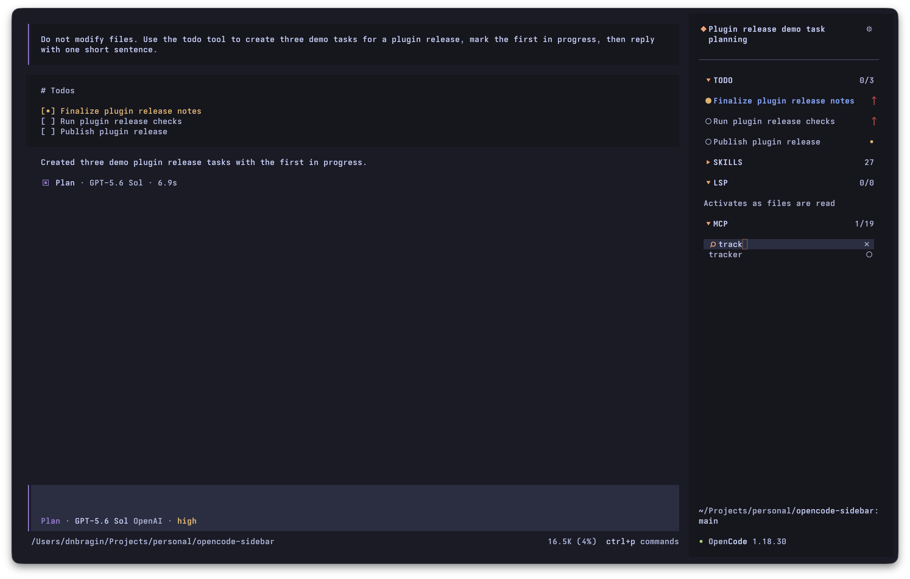
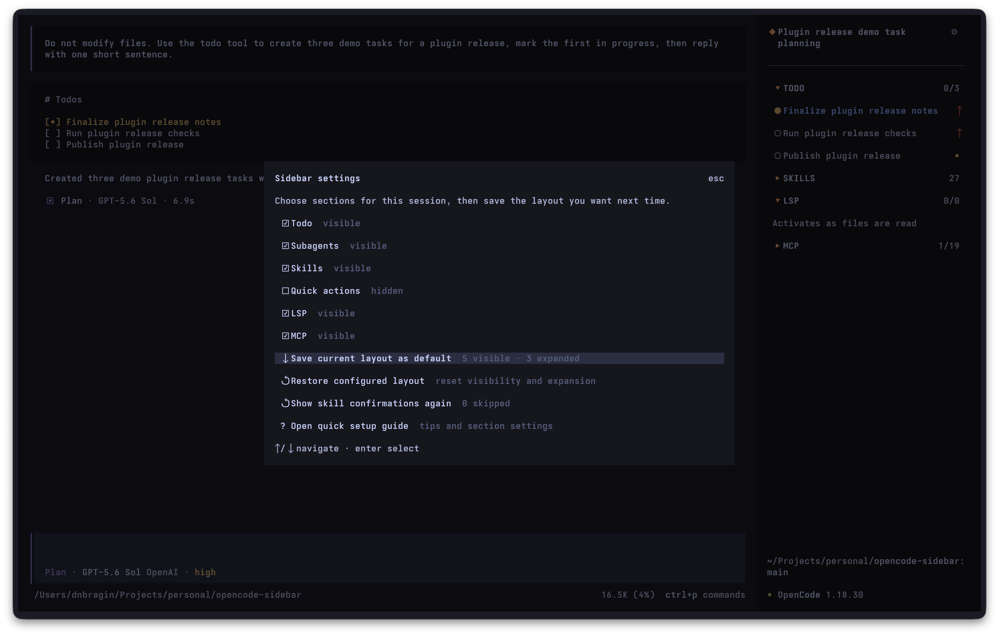
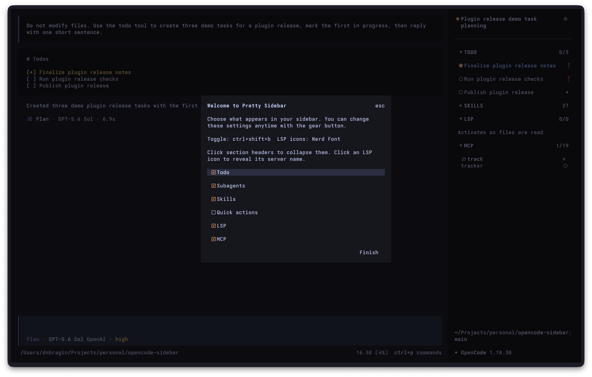
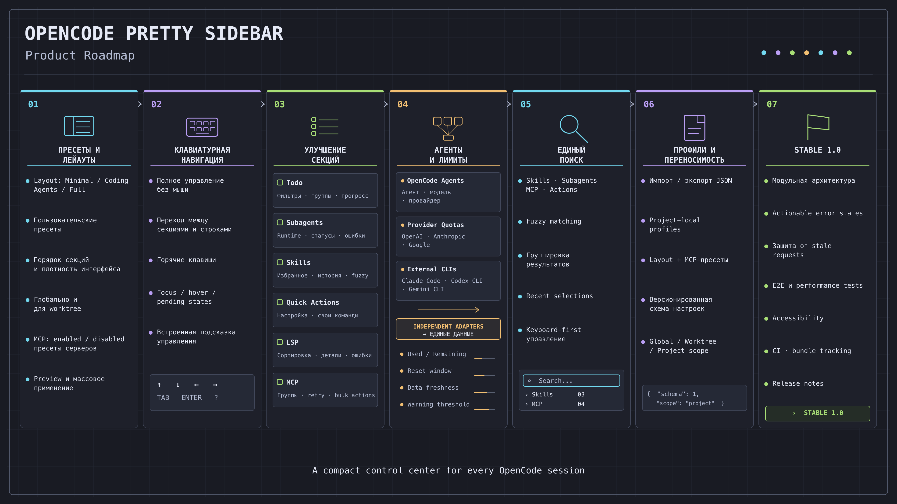

# Я устал от сайдбара OpenCode и написал свой

**Коротко:** мой сайдбар OpenCode превратился в длинный список MCP-серверов. При этом за задачами и субагентами всё равно приходилось следить в основном окне. Я написал TUI-плагин, который оставляет в правой панели только полезное прямо сейчас: Todo, активных субагентов, поиск по Skills и MCP и несколько частых действий. Исходники открыты, установка занимает одну команду.

Если вы пока только знакомитесь с OpenCode, сначала можно прочитать большой пост [«Как приручить AI-агента»](https://yandex-team.ru/atushka/post/4856997). Здесь я не буду заново объяснять агентов, Skills и MCP, а сосредоточусь на одном небольшом, но постоянно видимом кусочке интерфейса.

## С чего всё началось

Справа в терминальном OpenCode есть сайдбар с контекстом, MCP, LSP и Todo. Пока конфигурация небольшая, всё нормально. Потом она разрастается.

У меня зарегистрировано 19 MCP-серверов. Обычно нужны один-два, остальные выключены, но стандартная панель всё равно честно рисует весь список. Следом идут LSP и Todo. В итоге взгляд каждый раз пробегает по служебной информации в поисках пары важных строк.



Работать это не мешает. Раздражает по мелочи — зато каждый день. Как раз тот случай, когда несколько лишних секунд незаметны по отдельности, но интерфейс всё равно хочется поправить.

Я смотрю в эту часть экрана десятки раз в день, поэтому в какой-то момент решил перестать терпеть и сформулировал, чего хочу от сайдбара:

- с первого взгляда понимать, что сейчас делает агент;
- видеть прогресс по задачам и активных субагентов;
- быстро включать нужный MCP, не уходя в отдельное меню;
- запускать Skills и частые действия мышкой;
- не отдавать половину экрана спискам, которые сейчас не нужны.

Ничего революционного — просто панель, которой мне самому не хватало. Так появился `opencode-pretty-sidebar`.

## Что получилось



Вверху — название сессии и индикатор активности. Todo открыт сразу. Остальные блоки можно раскрыть, когда они понадобятся, и снова убрать. Путь проекта, ветка и версия OpenCode остались на привычном месте внизу.

Это не отдельный клиент и не форк OpenCode. Плагин встраивается в штатный TUI и использует его тему, состояние сессии, команды и диалоги. Отдельный «дашборд со всем» я намеренно не делал: если блок сейчас не нужен, он должен занимать одну строку или не показываться вообще.

## Todo и активные субагенты

Todo оказался наверху без долгих раздумий: во время большой задачи я чаще всего смотрю именно туда. В заголовке виден общий прогресс, внутри — статусы и приоритеты. Менять приоритеты из панели нельзя: публичного API для этого у OpenCode пока нет.

Subagents показывает активные дочерние сессии. В строке видны название и состояние; по клику можно сразу перейти внутрь. Закончил субагент работу — исчезла строка, а секция явно сообщает, что активных субагентов нет.



Так панель показывает происходящее сейчас, а не каталог всего, что теоретически можно запустить.

## Skills: поиск вместо длинного списка

Skills берутся из текущего workspace. На скриншоте их 27 — уже достаточно, чтобы листать было неудобно. Секция ищет по названию и описанию, а по клику подставляет `/<skill>` в prompt.



При выборе нового Skill сначала открываются его описание и кнопка подтверждения. Для знакомых команд этот шаг можно отключить, а при необходимости вернуть в настройках. Небольшая страховка от случайного запуска чего-то незнакомого.

## MCP: подключение прямо из сайдбара

С MCP и началась вся затея. Серверов много, а в конкретной сессии обычно нужны один-два.

Здесь список можно свернуть или отфильтровать по имени. Клик по строке подключает или отключает сервер, а `Connect all` и `Disconnect all` меняют все подходящие серверы параллельно. Индикаторы показывают прогресс каждого сервера; при частичном сбое успешные изменения сохраняются, а повторить можно только неудачные.



В настройках можно включить `Remember MCP states`. Тогда плагин запоминает включённое или отключённое состояние серверов глобально или отдельно для выбранного worktree. Тут есть ограничение: OpenCode запускает MCP раньше TUI-плагинов. Поэтому сервер, который должен быть выключен, при старте может ненадолго подключиться, а уже затем плагин его отключит. Сохранённые включённые серверы плагин подключает после своей инициализации.

## LSP и быстрые действия

От LSP мне нужен в основном ответ на вопрос «всё ли живо». Подключённые серверы поэтому занимают по одной Nerd Font-иконке. Название раскрывается кликом, а для терминалов без Nerd Font есть обычные текстовые бейджи.

В Quick actions я вынес частые штатные команды OpenCode:

- Rename;
- Timeline;
- Copy transcript;
- Export;
- Compact.

Плагин не пытается реализовать их заново: он вызывает команды OpenCode и рядом показывает keybindings из текущей конфигурации.

## Layout под конкретный сценарий

Не для каждой работы нужен один и тот же набор блоков. Любую секцию можно скрыть или свернуть, а удачную комбинацию сохранить для следующих сессий.



Настройки разделены на несколько коротких групп:

- `Preference scope` — глобальные значения или переопределения текущего worktree;
- `Sections` — видимость Todo, Subagents, Skills, Quick actions, LSP и MCP;
- `Section order` — порядок блоков, который меняется через `Shift+Up` и `Shift+Down`;
- `Behavior` — запоминание состояния MCP, стиль LSP-иконок, shortcut переключения и shortcut фокуса сайдбара;
- `Defaults & help` — сохранение и сброс layout, возврат настроек из `tui.json`, очистка MCP-состояний, сброс подтверждений Skills и повторный запуск setup guide.

Все параметры, которые раньше задавались только в конфиге плагина, теперь можно менять здесь. Behavior применяется сразу: можно переключить Nerd Font на текстовые бейджи, отключить запоминание MCP или назначить новые shortcuts без перезапуска OpenCode.

Для работы без мыши `Ctrl+Shift+F` переносит фокус в сайдбар. Дальше можно перемещаться стрелками или `j`/`k`, запускать выбранное действие через `Enter`, вернуться в prompt через `Escape`, а по `?` открыть короткую памятку. В палитре команд есть и прямые переходы к каждой секции.

Для layout сохраняются две вещи:

- какие секции видны;
- какие из видимых секций раскрыты;
- в каком порядке идут секции.

Пока я просто меняю layout, изменения живут только в текущем процессе OpenCode и не сохраняются после перезапуска. Настройки для следующих запусков обновятся после `Save current layout as default`. Перед редактированием можно выбрать глобальный scope или текущий worktree. Значения накладываются последовательно: настройки из `tui.json`, глобальные переопределения, переопределения worktree и временные изменения текущего процесса. Сброс layout, behavior или MCP удаляет только выбранный слой и снова показывает унаследованное значение.

При первом запуске открывается короткая настройка с выбором секций и подсказками по shortcuts сайдбара и режиму LSP-иконок. Оба shortcut и стиль иконок можно изменить через шестерёнку.



## Как это устроено

TUI-плагин написан на TypeScript/TSX, Solid и OpenTUI. Он регистрирует свои sidebar slots, клавиатурные слои и диалоги, а данные берёт из состояния OpenCode.

Я не стал складывать загрузку данных и UI в один большой компонент. За каждой секцией стоит небольшой контроллер:

- Todo и Subagents следят за сессиями и статусами;
- Skills получают навыки текущего workspace и добавляют команду в prompt;
- MCP синхронизирует список серверов и вызывает connect/disconnect;
- Preferences хранит layout, поведение, MCP-состояния, onboarding и пропущенные подтверждения Skills.

Больше всего времени ушло не на внешний вид, а на состояние. Это я выяснил неприятным способом: один из первых билдов принимал клики и сохранял новое значение, но на экране ничего не менялось. Клик есть, состояние записано, картинка старая. После перезапуска секция внезапно оказывалась раскрыта.

Причиной была лишняя копия Solid внутри bundle. Компоненты должны жить в том же reactive runtime, что и OpenCode, поэтому теперь `solid-js` и пакеты OpenTUI остаются внешними зависимостями.

Ещё одна неприятная мелочь — несколько одновременно открытых окон OpenCode. Если оба сохраняют настройки, последнее не должно случайно затереть первое. Поэтому preferences записываются через временный файл и `rename`, а от одновременной записи защищает lock-файл с PID владельца. Если процесс умер, следующий запуск распознает устаревший lock и уберёт его.

История с реактивностью показала, что обычных unit-тестов для такого интерфейса мало. Часть тестов теперь сначала собирает настоящий `dist/tui.js`, затем рендерит его через OpenTUI test renderer, нажимает мышкой, печатает в фильтрах и проверяет итоговый character frame. Отдельные проверки прогоняют клавиатурную навигацию, списки по 500 строк и загрузку собранного плагина в реальном OpenCode через PTY.

## Примерный roadmap

Идей уже больше, чем поместится в пару ближайших релизов. Основные направления: пресеты layout и MCP, улучшение существующих секций, единый поиск, переносимые профили и более подробная информация об агентах и лимитах.



Картинка фиксирует мои мысли на сегодня. Это ориентир, а не обещание выпустить всё именно в таком порядке и с такими номерами версий. Часть пунктов зависит от публичного API OpenCode, остальные буду двигать по отзывам. Если всем окажется нужен один небольшой фильтр, он спокойно обгонит большую фичу из картинки.

## Установка

Нужен OpenCode `1.18.30` или новее.

Для установки во все проекты:

```sh
opencode plugin --global opencode-pretty-sidebar
```

Для установки только в текущий проект уберите `--global`.

Команда добавит пакет в `plugin` внутри `tui.json`. Чтобы штатные блоки не дублировали Pretty Sidebar, их нужно отключить там же:

```json
{
  "$schema": "https://opencode.ai/tui.json",
  "plugin": ["opencode-pretty-sidebar"],
  "plugin_enabled": {
    "internal:sidebar-context": false,
    "internal:sidebar-mcp": false,
    "internal:sidebar-lsp": false,
    "internal:sidebar-todo": false
  }
}
```

После изменения конфигурации OpenCode нужно перезапустить. Сайдбар переключается через `Ctrl+Shift+B`, а `Ctrl+Shift+F` переносит в него клавиатурный фокус. Если терминал не различает `Ctrl+Shift+B` и `Ctrl+B`, shortcut можно заменить, например, на `Alt+S`.

Исходники и полная документация: [GitHub](https://github.com/St1ggy/opencode-pretty-sidebar).

Пакет: [npm](https://www.npmjs.com/package/opencode-pretty-sidebar).

Текущая версия на момент публикации — `0.6.0`.

## Нужен фидбек

Мой ежедневный сценарий плагин уже закрывает. Но это очень личная часть интерфейса: кто-то не пользуется мышью, у кого-то два MCP, а у кого-то пятьдесят, кому-то Todo вообще не нужен. Поэтому дальнейший порядок работ специально оставил гибким.

Попробуйте плагин и напишите в комментариях:

- каких данных вам не хватает в сайдбаре;
- какие секции вы бы добавили или убрали;
- удобно ли управлять Skills и MCP прямо из панели;
- что ломается в вашем терминале, теме или конфигурации.

Баги и предложения также можно приносить в [GitHub Issues](https://github.com/St1ggy/opencode-pretty-sidebar/issues).
